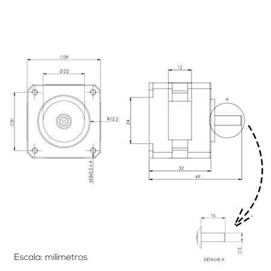
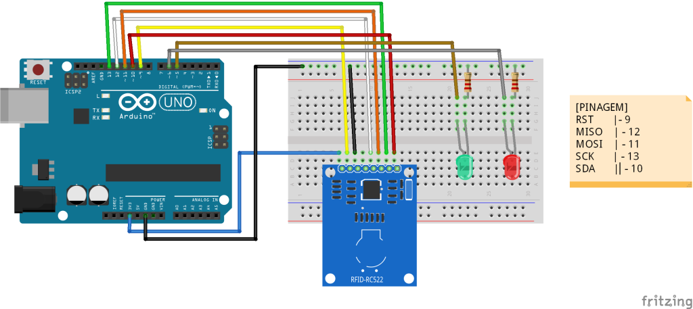
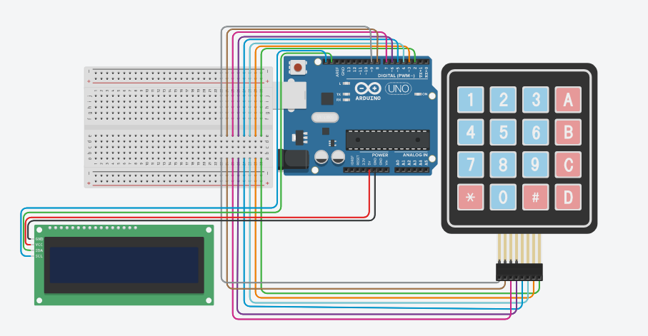

# Desenvolvimento de Games para Promoção de Feira de Conclusão do Curso Técnico Integrado em Telecomunicações do Campus São José

- Coordenador: [Prof. Clayrton Monteiro Henrique](https://github.com/henriquecmh)
- Participante: [Prof. Ederson Torresini](https://github.com/ederson-torresini)
- Bolsista: [Léo Jung Neves](https://github.com/leojungjung)
- Voluntário:	 [Vitor Henrique dos Santos Olipia](VitorHSO-VtV)

## Preâmbulo

Este documento apresenta os principais pontos para o desenvolvimento do projeto de pesquisa, especificando toda a parte física (hardware) e sua respectiva integração com a parte lógica (software). Para fins de sistematização e organização, o projeto conta com uma visão geral estabelecida em tópicos que serão apresentados a seguir.

## Resumo

Este projeto de pesquisa se propõe a estabelecer critérios, condições, métodos e cronograma de atividades com a finalidade de promover o desenvolvimento de games por parte dos alunos da oitava fase do Curso Técnico Integrado em Telecomunicações do IFSC Campus São José, visando como um dos produtos finais a apresentação geral para a comunidade escolar (interna e externa) como proposta de conclusão de curso aplicável ao ano de 2024. Para isso, é proposto o planejamento, a organização e a execução de uma feira de games interativa no âmbito do referido campus por parte de iniciativa dos referidos alunos. Esta feira permitirá, além da divulgação dos jogos desenvolvidos, estabelecer uma grande interação com os demais estudantes, comunidade externa e com profissionais convidados, a fim de permitir a ampliação da divulgação do curso frente a comunidade, atraindo novos ingressantes, bem como possibilitando o apoio e parcerias com empresas, visto que permite maior visibilidade para a instituição como motor agregador de conhecimento e de desenvolvimento em área de tamanha relevância tecnológica na atualidade, além do expressivo reconhecimento dos estudantes envolvidos pelo trabalho desenvolvido. Para que se possa atender esta
proposta, estabeleceu-se como ponto primordial a integração de diferentes disciplinas envolvidas na última fase do curso técnico integrado, a divisão da turma por equipes, além do aprendizado de conhecimentos sob demanda, de modo que permitam cumprir a sequência de atividades, visando atender ao cronograma estabelecido, o que culmina no atendimento dos objetivos da proposta no decorrer do corrente ano.

## Objetivos

O objetivo geral deste projeto visa o desenvolvimento de games por parte das equipes dos alunos da oitava fase do Curso Técnico Integrado em Telecomunicações do IFSC Campus São José, tendo como produto final a promoção de uma feira de games para a comunidade escolar. Visando atender o objetivo geral, pode-se citar como objetivos específicos: 

1. Integrar diferentes unidades curriculares de tal forma que seja viável a
compreensão dos conhecimentos necessários para o desenvolvimento dos games; 
1. Estimular e melhorar o processo de ensino e aprendizagem com problemas reais, desenvolvendo o protagonismo discente por meio de práticas que estimulem a busca por conhecimentos pautado especialmente na resolução de problemas, posicionando aos alunos uma visão mais ampla do que a de usuários; 
1. Estimular a criatividade e a capacidade de inovação dos alunos para o desenvolvimento das gameplays (enredo, histórias, fases, personagens, etc.); 
1. Buscar parcerias para que este projeto possa se tornar um evento recorrente no Campus; 
1. Implementar a organização, montagem e implementação da feira de games no hall principal do campus, atuando no sentido de viabilizar a infraestrutura de hardware e software necessárias à sua implementação; e 
1. Prover a divulgação dos cursos e das atividades desenvolvidas neste contexto para a comunidade (interna/externa).

# Parte 1: Máquina de Vendas Automática (*Vending Machine*)

## DESENVOLVIMENTO ELETRÔNICO

Este equipamento tem como principal objetivo permitir a despesa para os créditos obtidos na moeda digital da feira de games Tijolinhos ($TJL). Nesse sentido, serão ofertadas algumas bandejas as quais conterão gêneros alimentícios atrelados a um valor fixado pelo Banco Central Paredes (BCP), instituição proprietária da máquina e responsável pela gestão da moeda digital.

### Lista de Materiais

Motor de Passo, Driver, Fonte 12V/3A, Arduino Mega 2560, LED´s, Display LCD 4x20”, Teclado Numérico, Conexões, Bornes, Terminais, Jumpers, PCI, solda, termo retrátil, barra de terminais (macho e fêmea), Módulo Ethernet

#### Arduino MEGA 2560

Apresentar aqui o motivo pela seleção deste microcontrolador.

#### Motor de Passo

Apresentar as principais características do Motor de Passo Neoyama Modelo AK17/1.10F6LN1.8

#### Driver

Apresentar o desenvolvimento do Driver aqui e sua importância para o acionamento das bandejas…

#### Teclado Numérico Matricial 4x3

Apresentar o teclado numérico e suas conexões.

#### Leitor RF ID

Apresentar o teclado numérico e suas conexões.

#### Módulo Ethernet

Apresentar o módulo e sua importância para o projeto.

#### Display LCD 20x4

Apresentar o display, suas características e suas configurações neste cenário.

### Etapas do Acionamento:

## Fase 0 (Interna)

- Conexão ao BD;
- Inicialização de todos os periféricos;
- Leitura do status dos produtos por bandeja;

Descrição: Hardware sempre conectado via cabo ethernet.

### Fase 1 (Solicitação do Usuário)

- Digitação do Usuário;
- Validação com o BD (nuvem);
- Tela de boas-vindas (informar o Saldo??? e nickname???)

Descrição: banco de dados somente será requerido durante a interação via teclado, enquanto isso porta fechada (vulnerabilidade).

### Fase 2 (Interação do Usuário)

- Seleção do Produto (dentre aqueles com preço menor que saldo);
- Solicitação de confirmação de Produto e Valor;

Descrição: Outra opção seria a implementação de leitor RF Id, com o auxílio de tags 13,56MHz, não necessitaria utilizar o teclado numérico para validar conta, visto que a própria tag já possui tais informações, necessitando portanto apenas que o usuário a leia na máquina e selecione o produto, visto que o saldo será apresentado diretamente no display. Acredito ser importante validar a senha para débito (melhorar este aspecto).

### Fase 3 (Confirmação do Débito)

- Confirmar com senha???;
- Débito na conta 

Descrição: Digitar no teclado numérico o código de usuário (4 dígitos), o qual busca no BD o “nickname” do usuário e seu saldo, apresentado no display.

### Fase 4 (Efetivação da Compra)

- Ejeção do produto escolhido na bandeja específica;
- Atualização da quantidade do produto;
- Desconectar usuário;

# Parte 2: Controle e console de jogos (*arcade*)

## Desenvolvimento de software

### Código Arduino

### Código SQL

### Código MQTT
